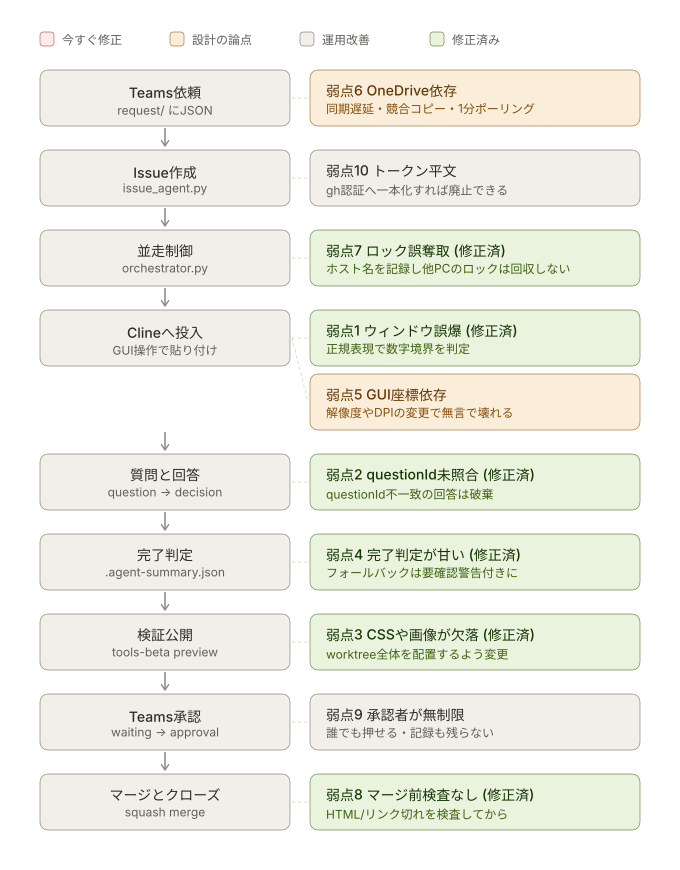

# Teams × Power Automate × Cline AIエージェント開発基盤

Teamsに依頼を書き込むと、GitHub Issueが立ち、Clineが実装し、
検証用サイトで動作確認し、Teamsで承認するとmainへマージされてIssueが閉じる。
この一連を**Issueごとに並走**させるための一式です。

```
Teams依頼
   ↓ ① Power Automate
request/*.json ──→ issue_agent.py ──→ GitHub Issue作成
                                        ↓ state/issue-N.json (created)
                                     orchestrator.py（並走制御）
                                        ↓ Issue 1件につき1プロセス
                                     implement_agent.py
                                        ├ git worktree + feature/issue-N-xxx
                                        ├ Clineへプロンプト投入
                                        ├ 質問 → question/ → ③ → decision/ → Clineへ返す
                                        ├ commit / push / ドラフトPR作成
                                        ├ tools-beta へプレビュー公開
                                        └ waiting/issue-N.json（承認待ち）
                                                 ↓ ④ Power Automate（承認カード）
                                           approval/issue-N.json
                                                 ↓
                                           approval_agent.py
                                     ┌───────────┼───────────┐
                                  承認         再実装         却下
                                     ↓           ↓            ↓
                             finish_agent.py  rework へ戻す  PRクローズ
                             squash merge     （再度実装）    変更破棄
                             Issueクローズ                    Issueクローズ
                             プレビュー削除
                             worktree削除
```

アクター（Teams / Power Automate / OneDrive / Python / Cline / GitHub）ごとに
誰が何をしていて状態がどう変わるかは、
[docs/01_architecture.md のスイムレーン図](docs/01_architecture.md#アクター別の流れと状態)を参照してください。

## 現状の弱点マップ

上の流れに、既知の設計上の弱点を重ねたものです。
**赤は今すぐ直すべき実バグ寄り、橙は設計そのものの論点、灰は運用しながらでよい改善**です。

<p align="center">
  
</p>

**1・2・3・4・7・8は修正済みです**（下表参照）。残る赤は無くなりました。
入口（Teams依頼）と出口（承認・マージ）に残る橙・灰は、
設計変更かPower Automate側の対応が必要なため未着手です。

弱点1・4・3はかつて連鎖する経路でした。
ウィンドウを取り違える → サマリーが作られないまま時間切れ → 変更なしでもコミット →
CSSが欠けたプレビューで承認を求める、という流れです。
1を直したことでこの連鎖の起点は消えていますが、3・4も独立に修正済みです。

| # | 弱点 | 該当箇所 | 対処 |
| --- | --- | --- | --- |
| 1 | ✅ ウィンドウ特定が部分一致 | `agent_core/cline.py` `focus_window` | 修正済み。数字境界つき正規表現 `(?<!\d)issue-N(?!\d)` で照合 |
| 2 | ✅ `questionId` を照合していない | `implement_agent.py` `wait_for_decision` | 修正済み。`questionId` 不一致の回答は破棄して待機継続 |
| 3 | ✅ プレビューが変更ファイルのみ | `deploy_preview.py` `copy_worktree_tree` | 修正済み。worktree全体（`.git`除く）を配置するよう変更 |
| 4 | ✅ 完了判定のフォールバック | `implement_agent.py` `wait_for_implementation` | 修正済み。フォールバック時は「未実施の確認」に警告を明示 |
| 5 | GUI自動操作への依存 | `agent_core/cline.py` | CLI型エージェントへ差し替え（`inject_prompt` のみ） |
| 6 | OneDriveをキューに使用 | 全体 | SharePointリストかStorage Queueへ |
| 7 | ✅ ロックがローカルPID基準 | `agent_core/locks.py` `_reclaim_if_stale` | 修正済み。ロックにホスト名を記録し、別ホストのロックは生死判定できないため自動回収しない。`agent_cli.py unlock` は別ホストのロックに `--force` を必須化 |
| 8 | ✅ マージ前の自動チェックなし | `finish_agent.py` `check_static` | 修正済み。`agent_core/checks.py` でHTML対応・リンク切れを検査。`repo-templates/` にCI版も同梱 |
| 9 | ✅ 却下でIssueをクローズ | `finish_agent.py` `reject` | 修正済み。openのまま `needs-rework` ラベルを付与。`agent_cli.py retry` でアーカイブから復元して再着手可能 |
| 10 | `GITHUB_TOKEN` が平文 | `agent_core/ghcli.py` | `gh issue create` に寄せてトークンを廃止 |

図は `docs/images/flow-weaknesses.svg`、生成スクリプトは `tools/build_svg.py` です。
残る5・6・7・10を潰したら、該当行と図の色を更新してください。

## 主な設計判断

| 論点 | 採用した方式 | 理由 |
| --- | --- | --- |
| 並走 | Issueごとに `git worktree` | 同一リポジトリでブランチ切替の競合が起きない。Gitの標準機能。 |
| GUI競合 | 「Clineへの貼り付け」だけロックで直列化 | 実装・待機・承認は並走させつつ、GUIは1つしか無いという制約を守る |
| 分岐戦略 | GitHub Flow（`feature/issue-N-slug` → `main`） | デファクトスタンダード。PRの `Closes #N` でIssueが自動クローズされる |
| マージ | `gh pr merge --squash --delete-branch` | 履歴が1Issue=1コミットで追いやすい。ブランチも自動削除 |
| 動作確認 | tools-beta の `preview/issue-N/` に配置しGitHub Pagesで公開 | Issueごとにパスが分かれるので並走してもプレビューが混ざらない |
| 状態管理 | `state/issue-N.json` を正本、工程フォルダは伝票 | 途中でプロセスが落ちても状態から再開できる |
| Teams通知 | Pythonは `reply/` へJSONを置くだけ | PythonにTeams認証を持たせない。失敗時も再送できる |

## フォルダ構成

```
ai-agent-system/
├── agent/
│   ├── agent_core/           共通モジュール
│   │   ├── config.py         環境変数・パス定義
│   │   ├── logs.py           ロガー
│   │   ├── jsonio.py         OneDrive安全なJSON入出力・done退避
│   │   ├── locks.py          ロック（デーモン/Issue/GUI）
│   │   ├── statefile.py      状態機械
│   │   ├── gitops.py         Git・worktree操作
│   │   ├── ghcli.py          GitHub操作
│   │   ├── teams.py          Teams通知（reply JSON出力）
│   │   ├── cline.py          VS Code / Cline のGUI操作
│   │   └── prompt.py         Clineプロンプト生成
│   ├── issue_agent.py        ①request監視 → Issue作成
│   ├── orchestrator.py       ②state監視 → 並走割り当て
│   ├── implement_agent.py    ③Issue 1件分の実装ワーカー
│   ├── deploy_preview.py     ④tools-betaへプレビュー公開
│   ├── approval_agent.py     ⑤approval監視 → 振り分け
│   ├── finish_agent.py       ⑥マージ・Issueクローズ
│   ├── dashboard_agent.py     補助: Issue状態ダッシュボード（tools-betaへ公開）
│   ├── agent_cli.py          運用コマンド
│   ├── tests/                自動テスト（pytest、133件）
│   ├── requirements.txt
│   └── requirements-dev.txt  テスト実行用（pytest）
├── scripts/
│   ├── setup.ps1             初期セットアップ
│   ├── start_all.ps1         常駐3本の起動
│   └── stop_all.ps1          停止
├── powerautomate/
│   ├── definitions/          フロー定義JSON
│   ├── 04_reply_to_teams.zip インポート用パッケージ（新規）
│   └── existing/             現行3フローのエクスポート
├── docs/
│   ├── 01_architecture.md    構成と状態遷移
│   ├── 02_setup.md           導入手順
│   ├── 03_power_automate.md  フロー設定
│   ├── 04_operations.md      運用・トラブルシュート
│   ├── 05_verification.md    実環境での動作確認チェックリスト
│   └── images/               各ドキュメントの図（SVG）
└── docs-html/                上記をブラウザで読む用に変換したHTML版（index.htmlから）
```

`docs-html/` はブラウザでそのまま開けます（`docs-html/index.html` から）。
Markdownを編集したら次で再生成してください。

```powershell
pip install markdown pymdown-extensions
python tools\build_docs_html.py
```

## クイックスタート

```powershell
# 1. セットアップ（環境変数・フォルダ・専用venv・依存パッケージ）
powershell -ExecutionPolicy Bypass -File .\scripts\setup.ps1

# 2. PowerShellを開き直し、このプロジェクト専用のvenvをアクティベートしてから点検
#    （他プロジェクトのvenvがアクティベートされたままだと混線するので注意）
.\.venv\Scripts\Activate.ps1
python agent\agent_cli.py doctor

# 3. Power Automate の4フローを設定（docs\03_power_automate.md）

# 4. 常駐エージェントを起動（同じvenvがアクティブな状態で）
powershell -ExecutionPolicy Bypass -File .\scripts\start_all.ps1 -Parallel 3

# 5. Teamsの依頼チャネルへ投稿してみる
```

`start_all.ps1` は新しいPowerShellウィンドウを開いて常駐プロセスを
起動しますが、`python` コマンドをそのまま使わず、このリポジトリの
`.venv` 内の `python.exe` を**絶対パスで直接指定**して起動します。
起動元シェルで別プロジェクトのvenvがアクティベートされていても、
新しいウィンドウ側がそれを引き継ぐことはありません
（手動でのアクティベートも不要です）。

## 自動テスト

`agent/tests/` に pytest ベースの回帰テストがあります（133件）。
実際のOneDrive・GitHub・Teamsには触れず、隔離された一時ディレクトリと
ローカルのgitリポジトリだけで完結するので、開発機でそのまま実行できます。

```powershell
cd agent
pip install -r requirements-dev.txt
pytest
```

修正した実バグ（弱点1・2・3・4・7・8・9）にはそれぞれ対応する回帰テストがあります。
コードを変更したら、コミット前に `pytest` を通してください。
`gh` コマンドが必要な範囲（Issue作成・PR操作・マージ）はテスト対象外です。

## 動作確認の最小手順

```powershell
# request を作らず、Issue番号を直接指定して実装ワーカーだけ動かす
python agent\implement_agent.py 123 --manual

# 承認せずにマージ処理だけ試す
python agent\finish_agent.py 123 --approve

# 状態を見る
python agent\agent_cli.py status
python agent\agent_cli.py show 123
```

詳細は `docs/` を参照してください。
