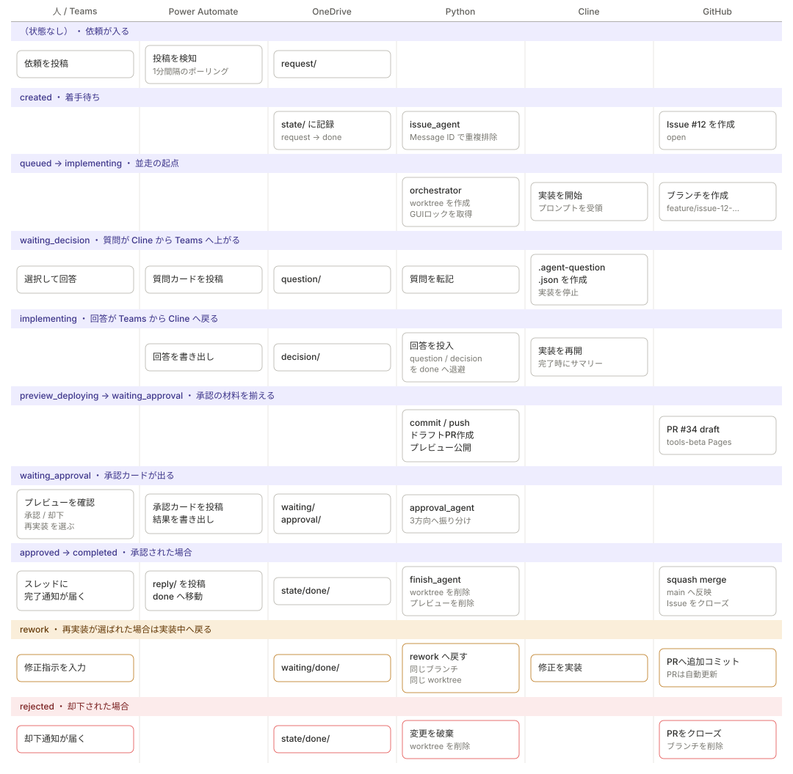

# 01. アーキテクチャ

## 1. 全体像

役割分担は次の通りです。

| 担当 | やること | やらないこと |
| --- | --- | --- |
| Teams | 依頼の入力、質問への回答、承認/却下/再実装の判断 | 状態の保持 |
| Power Automate | TeamsとOneDriveの橋渡し（投稿↔JSON） | 業務ロジック、Git操作 |
| OneDrive | 工程間のデータ受け渡しと状態の保存 | 処理 |
| Python | 業務ロジック、Git/GitHub操作、Cline制御 | Teams認証 |
| Cline (VS Code) | コードの実装 | git操作、PR作成 |
| GitHub | ブランチ・PR・レビュー・マージ・Issue管理 | — |

Power AutomateとPythonの間は**ファイルだけ**でやり取りします。
どちらかが止まってもJSONが残るので、再起動すれば続きから処理できます。

### アクター別の流れと状態

列がアクター、上から下が時間の流れです。
色の帯が `state/issue-<N>.json` の `status`、カードがそのとき誰が何をしているかを表します。

<p align="center">
  
</p>

この図から読み取ってほしいのは次の3点です。

**1. Python列がほぼ全ての帯に埋まっている**
業務ロジックをPythonへ集約した結果です。
Power Automate列が飛び飛びなのは健全な状態で、
ここにロジックが増え始めたら設計が崩れている合図です。

**2. OneDrive列が必ず2アクターの間に挟まっている**
TeamsとPythonが直接つながっている行は1つもありません。
だからどちらかが落ちてもJSONが残り、再起動で続きから流れます。

**3. 質問と承認は4アクターを跨ぐ**
`waiting_decision` と `waiting_approval` は
Cline → OneDrive → Power Automate → Teams と往復で8ホップします。
Power Automateのポーリングが1分なので、質問1回で数分が消えます。
体感速度のボトルネックはここです。

`rework` の帯では **worktreeもブランチも同じものを使い回します**。
PRが自動更新されるので意図通りですが、再実装の回数に上限が無いため、
同じブランチにコミットが積み上がる点には注意してください
（squash mergeするので最終的な履歴は1コミットにまとまります）。

図は `docs/images/actor-swimlane.svg`、生成は `tools/build_swimlane_svg.py` です。

## 2. OneDriveのフォルダ構成

```
work/agent/
├── request/     Teams投稿 → Power Automateが作成 → issue_agent が消費
│   └── done/
├── question/    Clineの質問 → Pythonが作成 → Power Automateが消費
│   └── done/
├── decision/    Teamsの回答 → Power Automateが作成 → Pythonが消費
│   └── done/
├── waiting/     実装完了 → Pythonが作成 → Power Automateが消費
│   └── done/
├── approval/    Teamsの承認結果 → Power Automateが作成 → Pythonが消費
│   └── done/
├── reply/       通知文 → Pythonが作成 → Power Automateが消費し投稿後doneへ
│   └── done/
├── state/       Issueごとの状態（正本）
│   ├── done/        完了・却下したIssueの状態
│   ├── locks/       ロックファイル
│   ├── processed/   Teams Message ID の重複防止マーカー
│   └── archive/
└── logs/        エージェントのログ
```

**原則**: 各フォルダのJSONは「その工程の伝票」です。
消費したプロセスが責任をもって `done/` へ移動します。

| フォルダ | 作る人 | 消費して done へ移す人 |
| --- | --- | --- |
| request | Power Automate ① | issue_agent.py |
| question | implement_agent.py | implement_agent.py（回答受領後） |
| decision | Power Automate ③ | implement_agent.py |
| waiting | implement_agent.py | approval_agent.py / finish_agent.py |
| approval | Power Automate ③ | approval_agent.py |
| reply | Python各所 | Power Automate ④（投稿後） |

## 3. 状態機械

`state/issue-<N>.json` の `status` が唯一の正です。

```
        (Teams投稿)
             │
             ▼
        created ──────────────┐
             │                │
    orchestrator が拾う        │ retry
             ▼                │
         queued               │
             │                │
             ▼                │
      implementing ◄──────────┤
        │        ▲            │
        │        │ 回答        │
        ▼        │            │
  waiting_decision            │
        │                     │
        ▼                     │
  preview_deploying           │
        │                     │
        ▼                     │
  waiting_approval            │
     ┌──┼──┐                  │
 承認 │  │  │ 再実装 ─→ rework ┘
     ▼  │  ▼
 approved│ rejected
     │   │     │
     ▼   │     ▼
 completed│  変更破棄・PRクローズ
          │  Issueはopenのまま
          │  needs-reworkラベル付与
          └ 却下
```

| status | 意味 | 次に動くもの |
| --- | --- | --- |
| `created` | Issue作成済み・着手待ち | orchestrator |
| `queued` | ワーカー起動予約 | implement_agent |
| `implementing` | Clineが実装中 | implement_agent |
| `waiting_decision` | Teamsへ質問し回答待ち | Power Automate ③ |
| `preview_deploying` | tools-betaへ公開中 | deploy_preview |
| `waiting_approval` | Teams承認待ち | Power Automate ③ |
| `approved` | 承認済み・マージ処理中 | finish_agent |
| `rework` | 差し戻し・再実装待ち | orchestrator |
| `completed` | マージ＆クローズ完了 | — |
| `rejected` | 却下。ブランチ/PRは破棄するが、**GitHub Issue自体はopenのまま** `needs-rework` ラベルを付けて残す | — |
| `failed` | 異常終了。`agent_cli.py retry` で戻せる | 人 |

`completed` と `rejected` になると `state/issue-N.json` は `state/done/` へ移動します。
`rejected` はGitHub Issue側はopenのままなので、内容を見直して
再着手したい場合は `agent_cli.py retry <N>` を実行してください
（`state/done/` から state を復元し、`created` に戻します）。

## 4. 並走の仕組み

### 4.1 作業ディレクトリの分離

```
C:\repo\tools                  ... 本体クローン（mainを保持、worktreeの親）
C:\repo\worktrees\issue-12     ... Issue #12（feature/issue-12-xxx）
C:\repo\worktrees\issue-13     ... Issue #13（feature/issue-13-yyy）
C:\repo\tools-beta             ... 検証用サイト
```

`git worktree` を使うことで、1つのクローンから複数のブランチを
同時にチェックアウトできます。`git checkout` の奪い合いが起きません。

Clineとの制御ファイル（`.agent-question.json` 等）も各worktree直下に
置かれるため、Issue間で混ざりません。ここが並走できるかどうかの分かれ目です。

### 4.2 同時実行数の制御

`orchestrator.py` が `AGENT_MAX_PARALLEL`（既定3）までの
`implement_agent.py` 子プロセスを同時に走らせます。

### 4.3 GUI（Cline）の排他

VS Codeへの貼り付けは物理的に1つずつしかできません。
そこで `state/locks/cline-gui.lock` による**GUIロック**を使い、
貼り付けの瞬間だけ直列化します。

```
Issue #12 ─ worktree作成 ─[GUIロック]貼付[解放]─ Clineが実装中 ─ 承認待ち
Issue #13 ──── worktree作成 ────────待機───[GUIロック]貼付[解放]─ 実装中
```

「実装中」「回答待ち」「承認待ち」は並走し、貼り付けだけが順番待ちになります。
実運用では貼り付けは数秒なので、これで十分に並走します。

**手動運用にする場合**: `--manual` を付けるとクリップボードへコピーするだけになり、
GUIロックも使いません。複数VS Codeを人が操作する運用に向きます。

### 4.4 その他のロック

| ロック | ファイル | 目的 |
| --- | --- | --- |
| デーモン | `locks/<agent>.lock` | 各常駐エージェントの二重起動防止 |
| Issue | `locks/issue-<N>.lock` | 同一Issueの多重処理防止 |
| GUI | `locks/cline-gui.lock` | Cline貼り付けの直列化 |
| tools-beta | `locks/tools-beta.lock` | プレビューpushの競合防止 |

いずれも所有プロセスのPIDを記録しており、プロセスが死んでいれば
自動的に回収されます（stale lock対策）。

## 5. Git運用（GitHub Flow）

```
main ──●────────────────────────●── (squash merge)
        \                      /
         ●──●──●  feature/issue-12-add-customer-api
         実装  修正
```

1. `origin/main` から `feature/issue-<N>-<slug>` を切る
2. Clineが実装 → Pythonがコミット＆push
3. **ドラフトPR**を作成（本文に `Closes #N`）
4. tools-beta で動作確認 → Teamsで承認
5. `gh pr ready` → `gh pr merge --squash --delete-branch`
6. `Closes #N` によりIssueが自動クローズ
7. プレビューとworktreeを削除

再実装（rework）の場合は同じブランチへコミットを追加するため、
PRは自動で更新されます。

## 6. 検証環境（tools-beta）

worktree全体（`.git` と `.agent-*` 制御ファイルを除く）を
`preview/issue-<N>/` 以下へそのまま配置します。

```
tools-beta/
└── preview/
    ├── issue-12/                ← worktree全体をコピー（baseブランチ＋変更）
    │   ├── index.html           ← サイト共通のトップページ（既存ファイル）
    │   ├── shared/style.css     ← 変更していない共有CSS（そのまま存在）
    │   └── customer/index.html  ← 今回変更されたファイル
    └── issue-13/
        └── ...
```

**変更ファイルだけをコピーしません。** worktreeは既に
「baseブランチ＋今回の変更」を含む完全なチェックアウトなので、
ディレクトリ全体をそのまま配置すれば、mainへマージした後と同じ構成になります。
以前は変更ファイルだけをコピーしていたため、変更したページが参照する
既存の共有CSSや画像が欠落し、崩れた状態のまま承認判断をさせてしまう
問題がありました（`deploy_preview.py` `copy_worktree_tree`）。

公開URL: `https://<owner>.github.io/tools-beta/preview/issue-<N>/`

マージまたは却下の時点で `preview/issue-<N>/` は自動削除されます。

## 7. ClineとのJSON契約

Clineには「チャットに書くだけでなくファイルを作る」ことを指示しています。
ファイルはすべてworktree直下、UTF-8 BOMなしです。

| ファイル | 作る側 | 意味 |
| --- | --- | --- |
| `.agent-question.json` | Cline | 人の判断が必要。作成後は実装を止める |
| `.agent-summary.json` | Cline | 実装完了報告。**これの作成＝完了判定** |
| `.agent-rework.txt` | Python | 差し戻し時の修正指示 |

これらは `.git/info/exclude` に自動登録され、コミット対象になりません。

### `.agent-question.json`

```json
{
  "type": "cline_question",
  "issueNumber": 12,
  "questionId": "customer-api-source",
  "question": "顧客データの取得元をどうしますか。",
  "choices": [
    { "id": "choice_1", "title": "customer.json から読む", "description": "..." },
    { "id": "choice_2", "title": "既存APIを流用する",     "description": "..." },
    { "id": "choice_3", "title": "その他（カスタム回答）", "description": "..." }
  ]
}
```

### `.agent-summary.json`

```json
{
  "issueNumber": 12,
  "summaryText": "Teams承認画面に表示する報告の全文",
  "implementation": ["実装した内容"],
  "verification": ["実際に確認した内容"],
  "notPerformed": ["未実施の確認"],
  "notes": ["承認者への注意事項"]
}
```

`verification` と `notPerformed` を分けているのは、
「確認したつもり」をそのまま承認画面に出さないためです。
