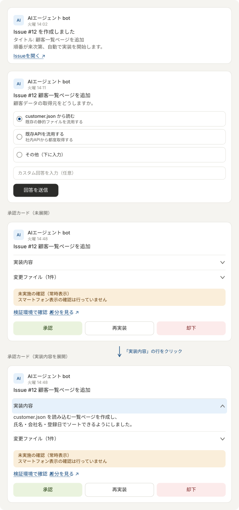

# 03. Power Automate の設定

フローは4本です。既存の3本はほぼそのまま使えますが、
**2箇所の修正が必須**です（本書 5章）。

| # | フロー名 | トリガー | やること |
| --- | --- | --- | --- |
| ① | Teams投稿 → request | Teamsチャネルの新規メッセージ | `request/*.json` を作る |
| ② | question → Teams質問 → decision | `question/` にファイル作成 | 選択式カードを出し、回答を `decision/` へ |
| ③ | waiting → Teams承認 → approval | `waiting/` にファイル作成 | 承認カードを出し、結果を `approval/` へ |
| ④ | reply → Teams通知 | `reply/` にファイル作成 | 通知を投稿し、ファイルを `reply/done` へ |

④は新規です。`powerautomate/04_reply_to_teams.zip` をインポートできます。

### Teamsに実際に届くカード（簡略版）

3種類のカードが時系列で届きます。
実際のAdaptive Cardの見た目そのものではなく、
「どの情報が」「どの操作と一緒に」届くかを示す簡略版です。

<p align="center">
  
</p>

上から、①Issue作成通知（②のトリガー完了直後）、②Clineからの質問カード
（選択肢は最大3件、3件目を自由記述の受け皿にしている）、
③実装完了の承認カード（未展開／実装内容を展開）、です。

### 承認カードの「実装内容」「変更ファイル」はアコーディオンにできる

Adaptive Cardには `Action.ToggleVisibility`（スキーマ1.2〜）があり、
見出し行をクリックすると中身が開閉する、上のようなアコーディオンを組めます。
承認カードが長くなりがちなので、補足情報は畳んでおくと読みやすくなります。

```json
{
  "type": "Container",
  "selectAction": {
    "type": "Action.ToggleVisibility",
    "targetElements": ["impl-body", "chev-up", "chev-down"]
  },
  "items": [
    { "type": "ColumnSet", "columns": [
      { "type": "Column", "width": "stretch",
        "items": [{ "type": "TextBlock", "text": "実装内容", "weight": "Bolder" }] },
      { "type": "Column", "width": "auto", "items": [
        { "type": "Image", "url": "chevron-down.png", "id": "chev-down", "width": "16px" },
        { "type": "Image", "url": "chevron-up.png", "id": "chev-up", "width": "16px", "isVisible": false }
      ]}
    ]}
  ]
},
{
  "type": "Container", "id": "impl-body", "isVisible": false,
  "items": [{ "type": "TextBlock", "text": "${implementationText}", "wrap": true }]
}
```

**「未実施の確認」だけは畳まないでください。**
理由は2つあります。

1. Clineが「確認したつもり」で書いた内容に承認者が引きずられないよう、
   未実施の項目は常に目に入る位置に置く必要がある
2. 新しいTeamsクライアントで `ToggleVisibility` が反応しない不具合が
   報告されており（2024年、Microsoft Tech Community）、
   トグルが壊れると中身ごと見えなくなる。判断に関わる情報は
   トグルの成否に依存させない

このカードに「未実施の確認」欄が空のまま届くようであれば、
`.agent-summary.json` が作られずフォールバック進行している可能性があるので、
`logs/issue-<N>.log` を確認してください（`docs/01_architecture.md` の弱点4を参照）。

図は `docs/images/teams-cards.svg`、生成は `tools/build_teams_cards_svg.py` です。

## 1. チャネル構成

チャネルは2つに分けてください。

| チャネル | 用途 |
| --- | --- |
| 依頼チャネル | 人が依頼を投稿する。①のトリガー元 |
| 通知チャネル | エージェントからの通知・質問・承認カード |

**同じチャネルにすると、Flow botの投稿が①のトリガーを再度引き、
Issueが無限に作られます。** 必ず分けるか、①にBot除外条件を入れてください。

Bot除外条件を使う場合は、①のトリガー直後に「条件」を置きます。

```
条件: @empty(coalesce(triggerBody()?['from']?['user']?['displayName'], ''))
  true  → 何もしない（Botの投稿）
  false → ファイルの作成
```

## 2. ① Teams投稿 → request

**トリガー**: Microsoft Teams「チャネルに新しいメッセージが追加されたとき」
（依頼チャネル / 1分間隔 / `splitOn: @triggerOutputs()?['body']`）

**アクション**: OneDrive for Business「ファイルの作成」

| 項目 | 値 |
| --- | --- |
| フォルダーのパス | `/work/agent/request` |
| ファイル名 | `agent_@{ticks(utcNow())}.json` |

ファイルコンテンツ:

```
@string(
  addProperty(
    addProperty(
      addProperty(
        addProperty(json('{}'), 'message', coalesce(triggerBody()?['body']?['content'], '')),
        'sender', coalesce(triggerBody()?['from']?['user']?['displayName'], '')
      ),
      'id', coalesce(string(triggerBody()?['id']), '')
    ),
    'datetime', utcNow()
  )
)
```

出力されるJSON:

```json
{
  "message": "<p>顧客一覧ページを作ってください</p>",
  "sender": "松田",
  "id": "1726900000000",
  "datetime": "2026-09-21T06:00:00Z"
}
```

`id` はTeamsのMessage IDです。Python側はこれで重複を判定するので、
**必ず含めてください**。HTMLタグはPython側で除去します。

### 2-1. 画像を含む投稿をIssueへ載せる（任意）

Python側（`issue_agent.py`）は、依頼JSONに `attachments` があれば、
その画像を `tools-beta` の `issue-assets/<Message ID>/` へ公開し、Issue本文の
「添付画像」欄に埋め込みます。さらに実装時は、worktreeの `.agent-attachments/`
（コミット対象外）へコピーし、Clineへのプロンプトで参考画像として伝えます。
`attachments` が無い依頼は従来どおり動くので、このフロー変更は後からで構いません。

**約束事（フロー①が守ること）**

1. 画像を `/work/agent/request/attachments/<Message ID>/<ファイル名>` へ保存する
2. **画像を全て保存してから**、最後に依頼JSONを作成する
   （依頼JSONの作成が `issue_agent.py` の起動合図になるため）
3. 依頼JSONに、保存した画像のファイル名一覧を追加する

```json
{
  "message": "<p>この画面のボタン配置を直してください</p>",
  "sender": "松田",
  "id": "1726900000000",
  "datetime": "2026-09-21T06:00:00Z",
  "attachments": [{ "name": "画面.png" }, { "name": "pasted-1.png" }]
}
```

対応する拡張子は `.png` `.jpg` `.jpeg` `.gif` `.webp`、1枚10MBまで、1件の
依頼につき10枚までです。それ以外は無視されます。OneDriveの同期が遅れて
画像がJSONより後に届いても、最大60秒は待ちます。揃わなかった画像は
Issue本文に「取得できなかった画像」として名前だけ残し、Issue作成は止めません。

**画像の公開範囲**: 画像は `tools-beta` に置かれ、URLを知っていれば誰でも
見られます（プレビューと同じ扱い）。社外に見せられない画像は投稿しないでください。

**ファイルとして添付された画像**

トリガーの出力 `attachments` のうち、`contentType` が `reference` の要素が
添付ファイルです（`name` にファイル名、`contentUrl` にSharePoint上のURL）。
チャネルに添付したファイルはチームのSharePointサイトの「ドキュメント」に
保存されているため、SharePointの「ファイル コンテンツの取得（パスによる）」で
中身を取得し、OneDrive for Businessの「ファイルの作成」で上記の場所へ保存します。
`contentUrl` からサイトのアドレスとファイルのパスを取り出す式は、実際の
`contentUrl` の形を見ながら組み立ててください。

**メッセージ欄に直接貼り付けた画像**

貼り付けた画像はファイルではなく、本文のHTMLに
`/$value">`
という形で埋め込まれ、取得にはMicrosoft Graphへの認証付きアクセスが必要です。
利用できるアクションはテナントの設定やライセンスによって異なるため、
まず次のどちらが使えるかを実際の環境で確認してください。

- Teamsコネクタの「Microsoft Graph HTTP 要求を送信します」（利用可能な場合）
- 「HTTP with Microsoft Entra ID」コネクタ（プレミアム）

本文HTMLから `hostedContents` を含む `src` を取り出し、そのURLへGETした結果を
`pasted-1.png`、`pasted-2.png` のような名前で保存します（貼り付け画像には
ファイル名が無いため）。JPEGでも拡張子を `.png` にしてしまって表示上の問題は
ほぼありませんが、分かる場合は実際の形式に合わせてください。

**動作確認（フローを変える前に、Python側だけ確かめる方法）**

OneDriveの `request/attachments/test-001/` に適当な画像 `a.png` を置き、
続けて次の内容で `request/test_image.json` を作ると、画像付きのIssueが作られます。

```json
{
  "message": "画像付き依頼のテストです",
  "sender": "動作確認",
  "id": "test-001",
  "datetime": "2026-09-24T00:00:00Z",
  "attachments": [{ "name": "a.png" }]
}
```

`request/attachments/` の画像は、Issue作成後も自動では消えません
（実装時にworktreeへコピーする元として使うため）。容量が気になる場合は、
完了したIssueの分を手で削除してください。削除しても、実装時は `tools-beta`
から取り直します。

## 3. ② question → Teams質問 → decision

**トリガー**: OneDrive「ファイルが作成されたとき」

| 項目 | 値 |
| --- | --- |
| フォルダー | `/work/agent/question` |
| サブフォルダーを含める | いいえ |
| 間隔 | 1分 |

**アクション構成**

1. ファイル コンテンツの取得
2. 作成（Compose）: `@base64ToString(body('ファイル_コンテンツの取得')?['$content'])`
3. JSON の解析

```json
{
  "type": "object",
  "properties": {
    "type": { "type": "string" },
    "messageId": { "type": "string" },
    "issueNumber": { "type": "integer" },
    "issueTitle": { "type": "string" },
    "questionId": { "type": "string" },
    "question": { "type": "string" },
    "choice1Id": { "type": "string" }, "choice1Title": { "type": "string" }, "choice1Description": { "type": "string" },
    "choice2Id": { "type": "string" }, "choice2Title": { "type": "string" }, "choice2Description": { "type": "string" },
    "choice3Id": { "type": "string" }, "choice3Title": { "type": "string" }, "choice3Description": { "type": "string" }
  }
}
```

4. Teams「アダプティブ カードを投稿して応答を待機」（通知チャネル）
   `Input.ChoiceSet id=selectedChoice` と `Input.Text id=customResponse`
5. Compose: `@base64(coalesce(outputs('Post_Question_Card')?['body/data/customResponse'], ''))`
6. Compose で回答オブジェクトを組み立て
7. OneDrive「ファイルの作成」→ `/work/agent/decision` / `issue-<N>.json`

Pythonが期待する `decision/issue-<N>.json`:

```json
{
  "issueNumber": 12,
  "questionId": "customer-api-source",
  "selectedChoice": "choice_1",
  "customResponseBase64": "44GT44KM...",
  "result": "answered"
}
```

`selectedChoice` が選択肢のidと一致するか、`customResponseBase64` に
中身があれば回答として受理されます。

> 選択肢が2つしかない質問では `choice3Id` が空になります。
> カード側で空の選択肢が出ないよう、`choices` を条件付きにするか、
> Python側で常に3件目に「その他（カスタム回答）」を入れる運用にしてください。

## 4. ③ waiting → Teams承認 → approval

**トリガー**: OneDrive「ファイルが作成されたとき」

| 項目 | 値 |
| --- | --- |
| フォルダー | `/work/agent/waiting` |
| 間隔 | **1分**（現状5分。遅いので変更推奨） |

**JSON の解析** のスキーマ（Pythonが出力する項目に合わせて拡張してください）:

```json
{
  "type": "object",
  "properties": {
    "type": { "type": "string" },
    "status": { "type": "string" },
    "messageId": { "type": "string" },
    "issueNumber": { "type": "integer" },
    "issueTitle": { "type": "string" },
    "issueUrl": { "type": "string" },
    "branch": { "type": "string" },
    "pullRequestNumber": { "type": "integer" },
    "pullRequestUrl": { "type": "string" },
    "changedFilesText": { "type": "string" },
    "summaryText": { "type": "string" },
    "implementationText": { "type": "string" },
    "verificationText": { "type": "string" },
    "notPerformedText": { "type": "string" },
    "notesText": { "type": "string" },
    "previewUrl": { "type": "string" }
  }
}
```

**承認カード**には次を載せると判断しやすくなります。

- `summaryText` … Clineの実装報告
- `verificationText` … 実際に確認した内容
- `notPerformedText` … **未実施の確認**（ここが重要）
- `changedFilesText` … 変更ファイル一覧
- `Action.OpenUrl` → `previewUrl`（tools-betaでの動作確認）
- `Action.OpenUrl` → `pullRequestUrl`（差分レビュー）
- `Action.Submit` → `{"action":"approve"}` / `{"action":"reject"}` / `{"action":"rework"}`
- `Input.Text id=reworkComment` … 再実装時の修正指示

**アクション**: OneDrive「ファイルの作成」→ `/work/agent/approval` / `issue-<N>.json`

```json
{
  "issueNumber": 12,
  "action": "approve",
  "reworkCommentBase64": "",
  "result": "answered"
}
```

## 5. 既存フローの必須修正

### 5-1. ③の出力先フォルダ（重要）

現状 `/work/agent/approval-test` になっています。
**`/work/agent/approval` へ変更してください。**
これを直さないと承認しても何も起きません。

### 5-2. ③のトリガー間隔

5分 → 1分へ変更してください。承認カードが出るまでの待ち時間が短くなります。

### 5-3. ③の「修正指示が空のとき」の分岐

現状、`action = rework` かつ修正指示が空の場合は
「修正指示を入力してください」と投稿するだけでフローが終わり、
カードが消費済みになるため**やり直せなくなります**。

カード側で入力必須にするのが確実です。

```json
{
  "type": "Input.Text",
  "id": "reworkComment",
  "isMultiline": true,
  "isRequired": true,
  "errorMessage": "再実装する場合は修正指示を入力してください。",
  "placeholder": "修正内容を具体的に入力してください。"
}
```

## 6. ④ reply → Teams通知（新規）

### インポート手順

1. Power Automate → **マイフロー** → **インポート** → **パッケージのインポート（レガシ）**
2. `powerautomate/04_reply_to_teams.zip` をアップロード
3. 「インポートのセットアップ」で Teams / OneDrive の接続を選択
4. インポート後にフローを開き、**トリガーのフォルダーを選び直す**
   （パッケージには `REPLACE_WITH_REPLY_FOLDER_ID` というプレースホルダーが入っています）
   → `/work/agent/reply` を選択
5. 「元の投稿へ返信」「通知チャネルへ投稿」のチーム／チャネルを確認
6. 保存してオンにする

### 手で作る場合

1. トリガー: OneDrive「ファイルが作成されたとき」`/work/agent/reply`（1分）
2. ファイル コンテンツの取得
3. Compose: `@base64ToString(body('ファイルコンテンツの取得')?['$content'])`
4. JSON の解析（`type` `status` `issueNumber` `issueTitle` `issueUrl` `branch` `messageId` `message` `previewUrl` `pullRequestUrl`）
5. 条件: `messageId` が空でない
   - はい → Teams「チャットまたはチャネルでアダプティブ カードを投稿する」（依頼チャネル / `replyToId` に `messageId`）
   - いいえ → 通知チャネルへ投稿
6. OneDrive「ファイルの移動」→ `/work/agent/reply/done/@{triggerOutputs()?['headers/x-ms-file-name']}`

`messageId` を使うと**元の依頼スレッドに返信**されるので、
依頼者は自分の投稿のスレッドで進捗を追えます。

> **ファイルの移動は必ず入れてください。** これが無いと reply が溜まり続け、
> トリガーが同じファイルを再処理して同じ通知が何度も飛びます。

## 7. reply JSON の種類

Pythonが出す `type` は次の通りです。カードの見た目を変える場合の分岐に使えます。

| type | タイミング |
| --- | --- |
| `issue_created` | Issue作成直後 |
| `implementation_started` | 実装開始 |
| `implementation_failed` | 実装失敗・タイムアウト |
| `rework` | 再実装開始 |
| `approved` | 承認されマージ開始 |
| `completed` | マージ・Issueクローズ完了 |
| `rejected` | 却下 |
| `encoding_error` | 文字化け検出によりマージ中止 |

## 8. 動作確認

各フローは「テスト」→「手動」で単体確認できます。
OneDriveトリガーのフローは、対象フォルダへ手でJSONを置くのが確実です。

```powershell
# 承認カードのテスト
@'
{
  "type": "implementation_completed",
  "issueNumber": 9999,
  "issueTitle": "テスト",
  "issueUrl": "https://github.com",
  "messageId": "",
  "branch": "feature/issue-9999-test",
  "changedFilesText": "- test/index.html",
  "summaryText": "テスト用の承認カードです。",
  "previewUrl": "https://example.com",
  "status": "waiting_approval"
}
'@ | Set-Content -Encoding UTF8 "$env:AGENT_ROOT\waiting\issue-9999.json"
```
